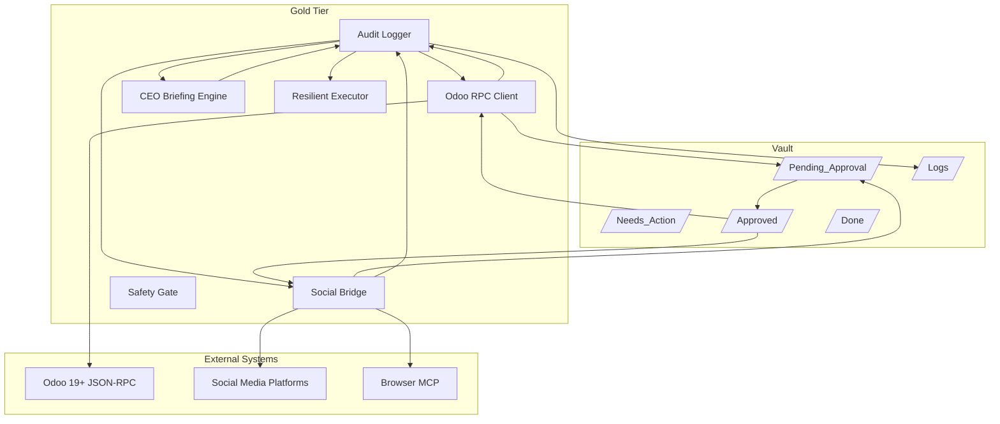

# Gold Tier Architecture

## Overview

The Gold Tier extends the Bronze/Silver architecture with autonomous business operations capabilities including Odoo accounting integration, social media management, and CEO briefing generation.

## Architecture Diagram



## Core Components

### 1. Ralph Wiggum Autonomous Loop

The autonomous execution engine that iterates over tasks until completion.

**Key Features:**
- Persistent state checkpointing for session resumption
- Exit promise detection (all plans complete + Needs_Action empty)
- Signal handling for graceful shutdown
- Configurable iteration limits and checkpoint intervals

**Files:**
- `agents/gold/autonomous_loop.py` - Main loop implementation
- `agents/gold/config.py` - Loop configuration constants

### 2. Odoo 19+ Integration

JSON-RPC client for Odoo Community Edition accounting operations.

**Key Features:**
- Authentication and session management
- Autonomous READ operations (search_read, read)
- HITL-gated WRITE operations (create, write)
- Credential redaction in logs and payloads

**Files:**
- `agents/gold/odoo_rpc_client.py` - RPC client implementation
- `agents/gold/config.py` - Odoo configuration

**Safety:**
- All WRITE operations draft to `/Pending_Approval/`
- Execution requires file movement to `/Approved/`
- API keys never persisted to vault files

### 3. Social Media Bridge

Multi-platform social media management via Browser MCP.

**Key Features:**
- Platform adapters (X, Facebook, Instagram)
- Content adaptation per platform limits
- HITL approval gating for all posts
- Engagement analytics aggregation

**Files:**
- `agents/gold/social_bridge.py` - Bridge implementation
- `agents/gold/config.py` - Platform limits and defaults

**Platform Limits:**
| Platform | Max Text | Max Images | Max Hashtags |
|----------|----------|------------|--------------|
| X | 280 | 4 | 3 |
| Facebook | 63,206 | 10 | 30 |
| Instagram | 2,200 | 10 | 30 |

### 4. CEO Briefing Engine

Weekly business audit and intelligence report generator.

**Key Features:**
- Revenue analysis (MTD vs Goal)
- Bottleneck detection (stale tasks)
- Subscription optimization audit
- Customizable templates per business type

**Files:**
- `agents/gold/briefing_engine.py` - Briefing generation
- `agents/gold/config.py` - Briefing configuration

**Schedule:**
- Default: Sunday at 22:00
- Output: `/Needs_Action/CEO-Briefing-YYYY-Www.md`

### 5. Resilient Executor

Three-layer resilience architecture for API operations.

**Layers:**
1. **Exponential Backoff** - For transient errors (429, 5xx, timeouts)
2. **Quarantine** - For logic errors (400, 401, 403, 422)
3. **Circuit Breaker** - Opens after 3 consecutive failures

**Files:**
- `agents/gold/resilient_executor.py` - Executor implementation
- `agents/gold/config.py` - Resilience configuration

### 6. Safety Gate

Gold-tier HITL gate with payment threshold and social gating.

**Triggers:**
- All social media posts
- All Odoo WRITE operations
- Payments > $100

**Files:**
- `agents/gold/safety_gate.py` - Safety gate implementation

### 7. Audit Logger

JSON-format audit trail with mandatory rationale field.

**Schema:**
```json
{
  "timestamp": "2026-03-08T10:00:00Z",
  "action": "odoo_read",
  "source_file": "Needs_Action/task.md",
  "details": "Fetch invoices",
  "result": "success",
  "rationale": "CEO Briefing revenue aggregation",
  "iteration": 5,
  "tier": "gold",
  "duration_ms": 150
}
```

**Files:**
- `agents/gold/audit_gold.py` - Audit logger
- `agents/gold/models.py` - GoldAuditEntry model

## Data Flow

### Task Execution Flow

```
1. Loop detects task in /Needs_Action/ or incomplete Plan
2. Determines if action requires HITL approval
3. If HITL required:
   a. Draft to /Pending_Approval/
   b. Halt execution
   c. Wait for human to move to /Approved/
   d. Execute action
   e. Move approval file to /Done/
4. If no HITL required:
   a. Execute action directly
5. Log action to /Logs/YYYY-MM-DD.json
6. Move task to /Done/ when complete
```

### CEO Briefing Flow

```
1. CronWatcher triggers on Sunday at 22:00
2. BriefingEngine aggregates data:
   a. Revenue from Odoo (search_read invoices)
   b. Bottlenecks from /Needs_Action/ (age > 48h)
   c. Subscriptions from Company_Handbook.md
3. Generate markdown briefing
4. Write to /Needs_Action/CEO-Briefing-YYYY-Www.md
5. Log action to audit trail
```

## Configuration

All Gold Tier configuration is centralized in `agents/gold/config.py`.

### Environment Variables

| Variable | Default | Description |
|----------|---------|-------------|
| `MAX_LOOP_ITERATIONS` | 1000 | Maximum loop iterations |
| `LOOP_CHECKPOINT_INTERVAL` | 1 | Checkpoint frequency |
| `ODOO_TIMEOUT` | 30 | Odoo RPC timeout (seconds) |
| `ODOO_MAX_RETRIES` | 3 | Odoo retry attempts |
| `BRIEFING_DAY` | 6 | Briefing day (0=Mon, 6=Sun) |
| `BRIEFING_HOUR` | 22 | Briefing hour (24h) |
| `REVENUE_GOAL` | 10000.0 | Monthly revenue target |
| `PAYMENT_APPROVAL_THRESHOLD` | 100.0 | Payment HITL threshold |

## Testing

### Unit Tests

```bash
pytest tests/unit/test_gold_*.py -v
```

### Integration Tests

```bash
pytest tests/integration/test_gold_*.py -v
```

### Test Coverage

- Models: Pydantic validation tests
- Loop: State persistence, exit promise, signal handling
- Odoo: Authentication, CRUD operations, approval workflow
- Social: Platform adapters, content validation, approval workflow
- Briefing: Revenue aggregation, bottleneck detection, subscription audit
- Resilience: Backoff, circuit breaker, quarantine
- Safety: HITL detection, threshold checks, approval workflow

## Security

### Credential Handling

- API keys loaded from `.env` only
- Never persisted to vault files
- Redacted in audit logs (`***`)
- Redacted in JSON-RPC payloads

### HITL Safety Gates

- All WRITE operations require approval
- All social posts require approval
- Payments > $100 require approval
- Approval files must be moved to `/Approved/` before execution

### Audit Trail

- All actions logged with rationale
- Immutable JSON log files
- Daily rotation (`YYYY-MM-DD.json`)
- Includes duration metrics

## Error Recovery

### Transient Errors

1. Exponential backoff: 1s, 2s, 4s, 8s, 16s (capped at 60s)
2. Retry up to 3 times
3. Log each retry attempt

### Logic Errors

1. Quarantine immediately (no retry)
2. Create P0 alert in `/Needs_Action/`
3. Move failed item to quarantine

### Circuit Breaker

1. Track consecutive failures per API
2. Open circuit after 3 failures
3. Reject calls while open
4. Reset on success

## Monitoring

### Key Metrics

- Loop iterations per session
- Tasks completed per iteration
- Average task duration
- API error rates
- Circuit breaker state
- Queue depths (Pending_Approval, Needs_Action)

### Log Analysis

```bash
# Count actions by type
jq -r '.[].action' Logs/2026-03-08.json | sort | uniq -c

# Find failed actions
jq '.[] | select(.result == "failure")' Logs/2026-03-08.json

# Calculate average duration
jq '[.[].duration_ms] | add / length' Logs/2026-03-08.json
```

## Deployment

### Local Development

```bash
# Setup
cp .env.example .env
# Edit .env with your Odoo credentials

# Run
python -m agents.gold.autonomous_loop
```

### Production

See `docs/deployment-gold.md` for production deployment guide.

## Related Documentation

- [Architecture Overview](architecture.md)
- [API Reference](api-reference.md)
- [Security Guide](security.md)
- [Development Guide](development.md)
- [Deployment Guide](deployment-gold.md)
